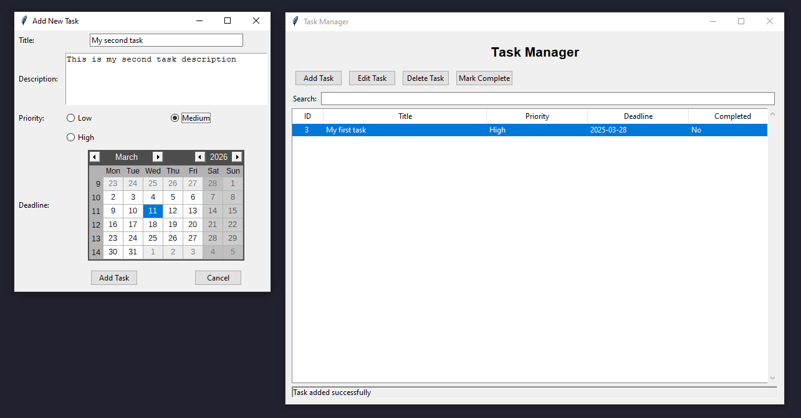

# Task Manager Application

## Overview

The Task Manager is a desktop application built with Python and Tkinter that helps users organize and manage their tasks efficiently. It provides features for adding, editing, deleting, and marking tasks as complete, with additional functionality for searching and sorting tasks.



## Features

- **Task Management**:
  - Add new tasks with title, description, priority, and deadline
  - Edit existing tasks
  - Delete tasks with confirmation
  - Mark tasks as complete/incomplete

- **Task Organization**:
  - Tasks are automatically sorted by priority (High > Medium > Low) and deadline
  - Completed tasks are displayed with strikethrough text
  - Search functionality to quickly find tasks

- **Database Integration**:
  - All tasks are stored in an SQLite database (`task_manager.db`)
  - Data persists between application sessions

## Requirements

- Python 3.x
- Tkinter (usually included with Python)
- Additional packages:
  - `tkcalendar` (install with `pip install tkcalendar`)

## Installation

1. Ensure you have Python 3.x installed
2. Install the required package:
   ```
   pip install tkcalendar
   ```
3. Download or clone the repository containing `main.py`

## Usage

1. Run the application:
   ```
   python main.py
   ```
2. The main window will appear with the following components:
   - Task list showing ID, Title, Priority, Deadline, and Completion status
   - Control buttons (Add, Edit, Delete, Mark Complete)
   - Search bar for filtering tasks

### Adding a Task
1. Click the "Add Task" button
2. Fill in the task details:
   - Title (required)
   - Description (optional)
   - Priority (Low, Medium, High)
   - Deadline (select from calendar)
3. Click "Add Task" to save or "Cancel" to discard

### Editing a Task
1. Select a task from the list
2. Click the "Edit Task" button
3. Modify the task details as needed
4. Click "Update Task" to save changes or "Cancel" to discard

### Deleting a Task
1. Select a task from the list
2. Click the "Delete Task" button
3. Confirm the deletion when prompted

### Marking Tasks Complete/Incomplete
1. Select a task from the list
2. Click the "Mark Complete" or "Mark Incomplete" button (text changes based on current status)

### Searching Tasks
1. Type in the search box to filter tasks
2. The list will update in real-time as you type

## Database

The application uses SQLite to store tasks in a local database file named `task_manager.db`. The database is automatically created when the application first runs and contains a single table:

```sql
CREATE TABLE tasks (
    id INTEGER PRIMARY KEY AUTOINCREMENT,
    title TEXT NOT NULL,
    description TEXT,
    priority TEXT NOT NULL,
    deadline TEXT,
    completed INTEGER DEFAULT 0,
    created_at TEXT DEFAULT CURRENT_TIMESTAMP
)
```

## License

This project is open-source and available for free use and modification.

## Future Enhancements

- Add task categories or tags
- Implement task reminders/notifications
- Add export/import functionality
- Support for multiple user accounts
- Dark mode/theme support
